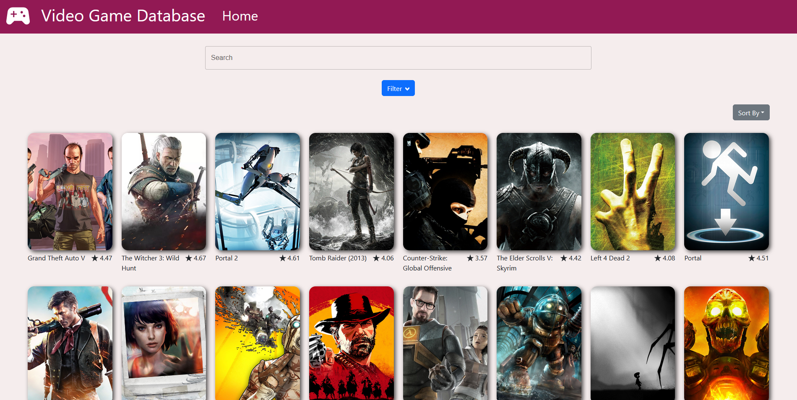
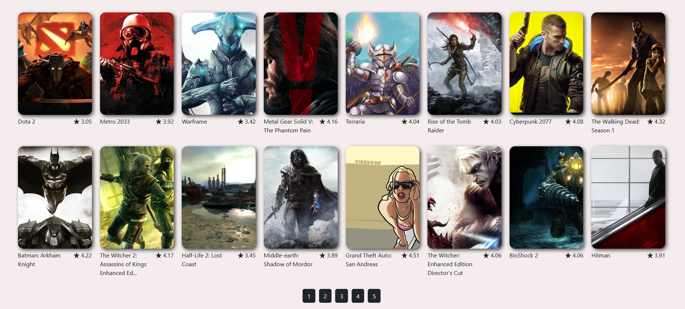
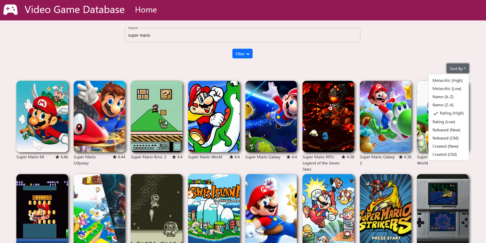
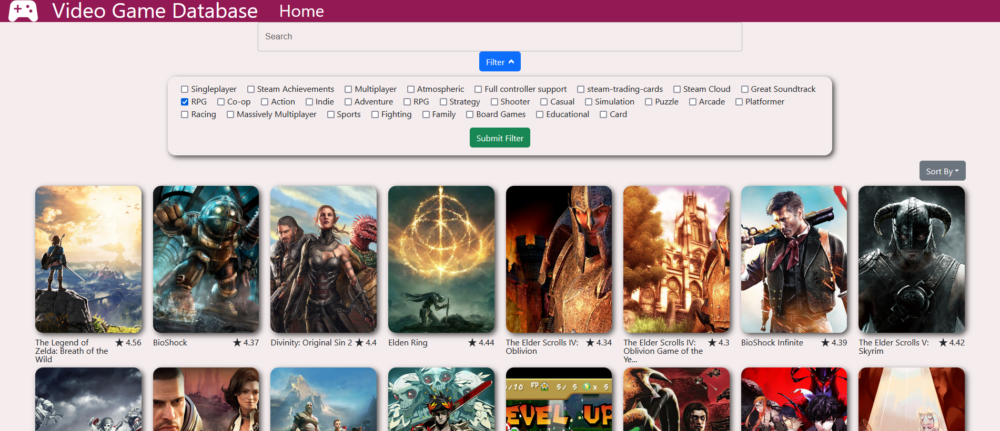

# Video Game Database

This application is a searchable, filterable, sortable video game database that displays information regarding each game made with React.

## Prerequisites for building

If you'd like to fork and build this application yourself, you'll need to get some API keys and make a file for these API keys.

## API keys

If you take a look in src\api\index.js you'll see there are some API keys that are being used when calling the API. You'll need to make a .env file in your project's root directory (outside the src folder) and declare two variables. The first variable will be <code>REACT_APP_RAWG_KEY=</code> followed by your API key from the RAWG website found <a href="https://rawg.io/apidocs">HERE</a>. The second variable will be <code>REACT_APP_RAPIDAPI_KEY=</code> followed by your API key from RAPIDAPI for RAWG found <a href="https://rapidapi.com/accujazz/api/rawg-video-games-database/">HERE</a>. No semicolon is needed when declaring these variables. Make sure to save! Some of the API calls could be rewritten to only use the API directly from the RAWG website if you wish instead of using the RAPIDAPI API.

## Building

This project is built using yarn. Open powershell/terminal and ensure you're in the game-database project directory. Next, type <code>yarn build</code> and allow the project to build. In the powershell/terminal console it should tell you that you may serve with <code>serve -s build</code>, but if you're having issues serving the application type <code>yarn serve -s build</code> instead.

# How to use

To start, if you'd like to begin using the application you can start by scrolling down the page to look at various games with no specific filter parameters. Every game is clickable, allowing you to view more details about the game. There are page buttons at the bottom of the page which allows for pagination. If you'd like to back to the front page, you can either choose the first-page button at the bottom of the page, the very back button if you're a few pages ahead, the Home title in the header, or the icon in the header.

To begin searching, type the title of the game you wish to search for. Once the page has loaded, you'll see a list of games that match your search. You can use the Sort By function to the top right of the list of games to sort by Created By, Metacritic Rating, Name, User Rating, Released Date.

To begin filtering, open the filter menu by clicking on the blue Filter button below the search field. Once opened, you'll be prompted to check off your choice of tag and genre. Once you're done selecting, click on the green Submit Filter button to filter your choices.

To find more details about a game, click on the picture of whichever game you'd like. Once you click on the picture, you'll be met with a page showing various details regarding the game. At the top, you'll see a trailer if available. Below that you'll see the screenshots to the left, allowing the smaller screenshots to be clicked to change the main screenshot. To the right, you'll see text detailing information regarding the game including the title, release date, description, publishers, and more. Below the screenshots is a section for the stores if available. Each store is clickable and will open a new tab directly to the store for that game. 

